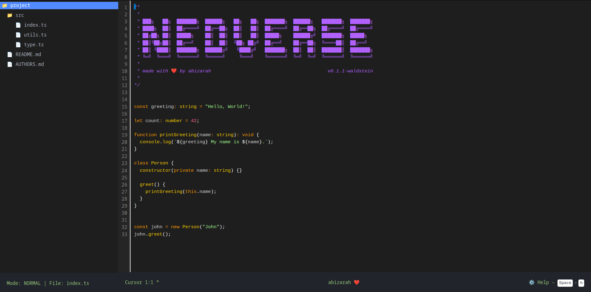

<p align="center">

</p>

<h1 align="center">
   Neoverse
</h1>

<p align="center">
Neoverse is a web based application that simulates the experience of using Neovim, a popular terminal-based text editor. Built with React and TypeScript, this project provides an interactive interface for learning and practicing Neovim without the need to install the actual application.
</p>

<p align="center">

</p>


<br>


## Disclaimer
This playground was working based on my own configuration

## Features

- **Neovim Mode Simulation**: Supports Normal, Insert, Command, and Visual modes.
- **File Explorer**: Left-side panel displaying file and folder structure.
- **Interactive Editor**: Main editing area with basic syntax highlighting.
- **Cursor Movement**: Navigate using arrow keys or standard Vim keys (h, j, k, l).
- **Basic Editing**: Supports adding and deleting characters.
- **Status Bar**: Displays current mode, cursor position, and active file.

## How to Use

1. **File Navigation**:
   - Use the left panel to browse the file structure.
   - Click on a file to open it in the editor.

2. **Editor Modes**:
   - **Normal Mode**: Default mode. Use for navigation and commands.
   - **Insert Mode**: Press `i` to enter insert mode and start editing.
   - **Visual Mode**: Press `v` to enter visual mode (limited functionality).
   - **Command Mode**: Press `:` to open terminal.

3. **Navigation**:
   - Use arrow keys or Vim keys (h, j, k, l) to move around.
   - `o` in Normal mode to create a new line and enter Insert mode.

4. **Editing**:
   - In Insert mode, type to add text.
   - Use Backspace to delete characters.

5. **Exiting Modes**:
   - Press `Esc` to return to Normal mode from other modes.

## Development

### Prerequisites

- Node.js (version 12 or later)
- npm or yarn

### Installation

1. Clone the repository:
   ```
   git clone https://github.com/Abizrh/neoverse.git
   ```

2. Navigate to the project directory:
   ```
   cd neoverse
   ```

3. Install dependencies:
   ```
   pnpm install
   ```
   or if using yarn:
   ```
   yarn install
   ```

4. Run the application in development mode:
   ```
   pnpm run dev
   ```
   or with yarn:
   ```
   yarn run dev
   ```

5. Open `http://localhost:5173` in your browser.

## Contributing

Contributions are always welcome! If you'd like to contribute, please create a pull request or open an issue for discussion about new features or bug fixes.

## License

This project is licensed under the MIT License. See the `LICENSE` file for details.
